# 3D OBJ Explorer for Apple IIGS

**A Tribute to Robert DONY**  
*Author of "Calcul des parties cachées", Masson, 1986*

A 3D model viewer and explorer implementing multiple painter's algorithms, specifically designed for the Apple IIGS computer using ORCA/C and the QuickDraw graphics API.

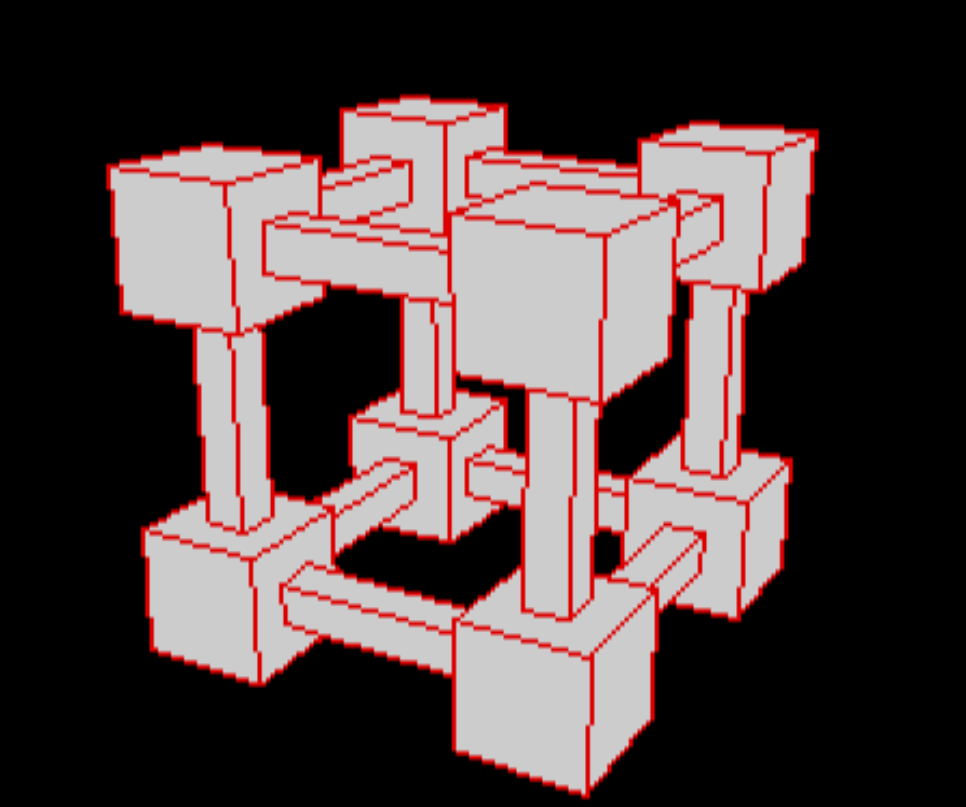

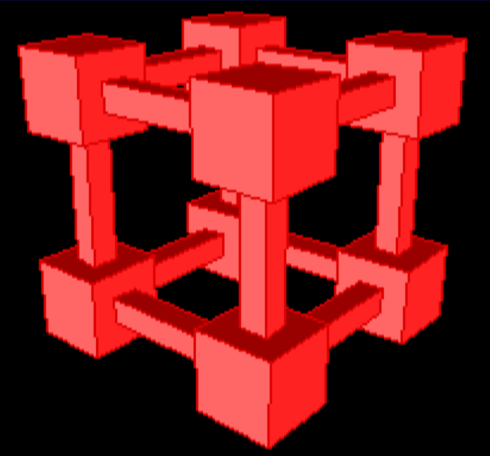
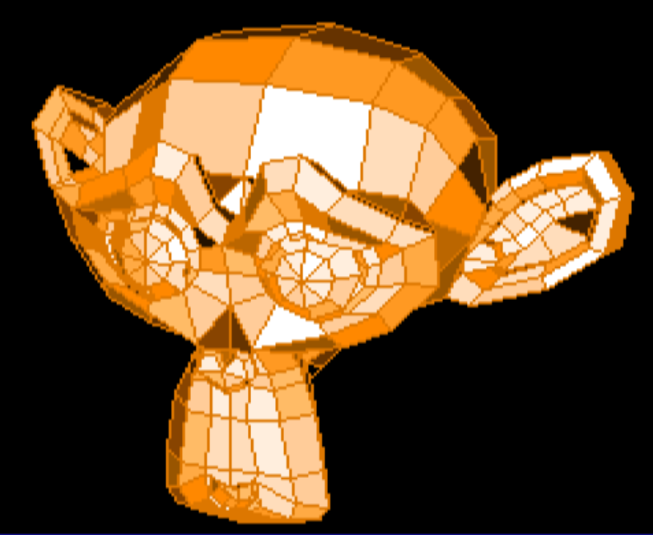

## Overview

3D Explorer is an interactive 3D rendering application that reads simplified Wavefront OBJ files and displays them with manipulation capabilities. The project demonstrates advanced rendering techniques on resource-constrained hardware (Apple IIGS with 2.8 MHz 65C816 CPU) through careful optimization and multiple algorithm implementations. It performs satisfactorily on a modern computer and in emulation mode, due to the large number of calculations it requires.

It is built around the painter's algorithm: faces are sorted and drawn back-to-front so that nearer polygons naturally occlude farther ones without a Z-buffer. The application includes several painter variants, from fast z-mean ordering to more robust geometric correction passes for overlapping and intersecting faces.

## Getting Started

1. **Load a model**: Run the program and enter the path to a simplified OBJ file when prompted. After entering the file path, press `Enter` five times in a row to accept the default values for distance, horizontal angle, vertical angle, screen rotation, and any additional prompts. Those defaults can still be changed later through the application controls.
2. **Now you see the 3D object centred on the screen**
3. **Use the controls**: Navigate the scene with the keyboard and switch rendering modes using keys `1` through `7`.
4. **Change the color palette**: Press `G` to cycle through the available color palettes.
5. **Choose colors**: Press `>` to choose the fill color and `<` to choose the frame color, from an on-screen color chooser.
6. **Enable orientation shading**: Press `!` to toggle orientation-based shading on and off.
7. **Inspect faces**: Press `V` to inspect a single face, then press `Space` to view detailed face information. Use `V` (in that detail screen) to reverse the vertex winding of the selected face and update its front/back classification, `H`/`R`/`A` to hide, restore, or restore all faces, and `N` (in the main face viewer) to toggle display of the face's normal.
8. **Inspect face pairs**: Press `Q` to inspect a pair of faces, navigate between pairs, diagnose ordering anomalies, and use `R` to move the farther face in front of the nearer face or `E` to move the nearer face behind the farther face in the sorted face list.
9. **Get full help**: Press `H` to display the complete keyboard help screen and command summary.
10. **Repair ordering**: Press `;` to run the face order repair helper, and press `.` to run `check_sort_repair_fast` for a QuickDraw-centroid-based minimal repair.

### Why use this explorer/viewer?

- It is optimized for the Apple IIGS hardware and demonstrates fixed-point 3D rendering techniques.
- It includes advanced painter algorithms for difficult overlapping geometry.
- It provides a scanline Z-buffer rendering
- It provides interactive inspection and debugging tools for face order, overlap, and visibility issues.

## Limitations 
However, it has many limitations, including: speed (requires an accelerator or emulator), the number of vertices and faces, the number of vertices per face, very limited handling of intersecting faces, and handling of the case of cyclic overlap by scanline Z-buffer only.
Example : 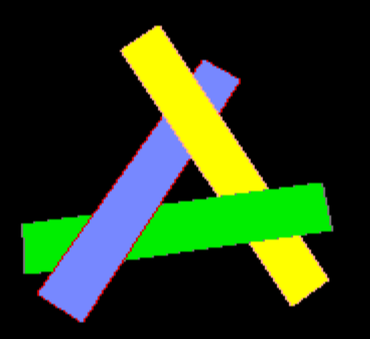
This image couldn't have been generated with painters as they are implemented here. But Z-Buffer scanline function (triggered by 'O' key) do it correctly.

### Quick start keys

- `H`: show full help screens
- `1`: FAST mode
- `2`: BUBBLE SORT mode
- `3`: NEWELL SANCHA mode
- `4`: GEO mode
- `5`: GEO V3 mode
- `6`: CORRECT mode
- `7`: CORRECT V2 mode
- `O`: experimental scanline Z-buffer mode (prototype, slow)
- `8`: random colors (quick mode, sets both fill and frame to random)
- `>`: choose fill color (interactive color chooser)
- `<`: choose frame color, including "same as fill color" = no separate border (interactive color chooser)
- `9`: reset colors to defaults, restore palette 0, and disable orientation shading
- `B`: toggle back-face culling
- `P`: toggle wireframe (frame-only) rendering
- `C`: toggle palette display overlay
- `G`: cycle through available color palettes
- `!`: toggle orientation-based shading
- `V`: inspect a face, arrow to navigate, 'space' for options (record face data in a file, revert vertex order)
- `Q`: inspect a face pair and navigate between pairs
- `;`: repair face order
- `.`: repair face order (fast, QuickDraw-centroid-based)

### Key Features

- **Multiple Painter Algorithms**: Seven distinct rendering modes optimized for different use cases (FLOAT is archived)
  - **FAST**: Simple Z-mean sorting with bounding box tests (highest performance)
  - **BUBBLE SORT**: Full pairwise-comparison sort using a bubble-sort ordering pass (Fixed32/64 arithmetic)
  - **NEWELL SANCHA**: Full Newell-Sancha algorithm with Fixed32/64 arithmetic (robust)
  - **GEO**: Geometry-only heuristic painter mode; plane/ordering tests without the full local correction pipeline
  - **GEO V3**: Geometry-only mode inspired by R. Dony's book, without face-splitting handling; can be slow on large models
  - **CORRECT**: Advanced ordering correction with local face reordering (homebrew implementation)
  - **CORRECT V2**: Experimental local correction, homebrew implementation V2 (`painter_correctV2`)
  
- **3D Manipulation**: Interactive camera controls with adjustable distance, rotation angles, and 2D panning
- **Advanced Culling**: Observer-space back-face culling to eliminate hidden polygons
- **Diagnostic Tools**: Face inspection, overlap detection, and visual debugging capabilities
- **Fixed-Point Arithmetic**: Optimized 16.16 and 32.32 fixed-point math for efficient 3D transformations
- **Performance Optimization**: Precomputed trigonometric tables and memory buffer reuse

## Technical Architecture

### Graphics Pipeline

1. **Model Loading**: Parse simplified OBJ files (vertices `v` and faces `f`)
2. **3D Transformation**: Transform model vertices from world space to observer space
3. **Projection**: Convert 3D coordinates to 2D screen space with perspective correction
4. **Face Sorting**: Apply selected painter algorithm to determine rendering order
5. **Rasterization**: Draw filled polygons using QuickDraw API

### Rendering Modes

#### FAST Mode (Key: `1`)
- Simple face sorting by Z-mean (average depth)
- Bounding box overlap tests for early rejection
- Best for high frame rates on simple geometry
- Limitations: May produce artifacts on complex overlapping polygons

#### BUBBLE SORT Mode (Key: `2`)
- Full pairwise-comparison sort of the face list using a bubble-sort ordering pass
- Fixed32 (16.16) / Fixed64 (32.32) arithmetic
- More thorough than FAST, but without the full geometric test battery of NEWELL SANCHA

#### NEWELL SANCHA Mode (Key: `3`)
- Based on Newell-Sancha (V1) pairwise comparison algorithm (implemented as `painter_newell_sancha`)
- Comprehensive geometric tests per face pair:
  1. **Test 1**: Z-extents overlap check (cheap rejection)
  2. **Test 2**: X-extents overlap check
  3. **Test 3**: Y-extents overlap check
  4. **Test 3bis**: Projected polygon overlap check (early conclusion if no overlap)
  5. **Test 4**: All vertices of f2 on observer's side of f1's plane
  6. **Test 5**: All vertices of f1 on opposite side of f2's plane
  7. **Test 6**: All vertices of f2 on opposite side of f1's plane (requires swap)
  8. **Test 7**: All vertices of f1 on observer's side of f2's plane (requires swap)
- Projected polygon overlap test as final verification when all other tests are inconclusive
- Fixed32 (16.16) and Fixed64 (32.32) arithmetic throughout
- Most robust for complex geometry

#### GEO Mode (Key: `4`) — ⚠️ CAN BE VERY SLOW ON LARGE MODELS
- Geometry-only painter mode that uses plane-based ordering heuristics
- Uses `painter_geoV2` with ray-casting for depth ordering
- **WARNING**: This mode is significantly slower than other painters for large models due to intensive geometric calculations
- Recommended ONLY for small models or diagnostic purposes
- Not suitable for interactive work on larger meshes

#### GEO V3 Mode (Key: `5`) — ⚠️ CAN BE VERY SLOW ON LARGE MODELS
- Geometry-only mode inspired by R. Dony's book (`painter_geoV3`), without face-splitting handling
- Shares the same performance caveats as GEO mode on large models
- Recommended ONLY for small models or diagnostic purposes

#### CORRECT Mode (Key: `6`)
- Extends NEWELL SANCHA mode with local face reordering after separating faces into FRONT and BACK groups, homebrew implementation
- Attempts to resolve ordering conflicts through strategic swaps between those groups
- Best for geometries with many inconclusive pairs
- Slower

#### CORRECT V2 Mode (Key: `7`)
- Experimental variant, homebrew implementation: `painter_correctV2`
- Separates faces into FRONT and BACK groups before applying local corrections
- Improves robustness of face sorting when culling is OFF
- Locally corrects cases where a BACK face appears in front and overlaps a FRONT face (need to be improved)
- Uses geometric plane tests for overlapping faces, with zmean as a deterministic fallback (no global reordering)
- Diagnostic/log code is present but disabled by default (file output commented out, can be re-enabled for analysis)
- Slower, mainly for pathological models or advanced debugging

#### Scanline Z-Buffer Mode (Key: `O`)
- Alternative renderer, entirely separate from the painter's-algorithm pipeline (does not sort faces, does not touch `processModelFast` or `calculateFaceDepths`)
- Rasterizes each face scanline by scanline, computing per-pixel edge intersections and even-odd span pairing — correctly handles concave faces (e.g. a star) without special-casing
- Depth is resolved per pixel via a single-scanline (320-entry) buffer of interpolated `1/z` (perspective-correct), rather than sorting whole faces — this can correctly resolve cases where two faces interpenetrate or interleave in depth by only a small margin, which the painter's algorithm cannot represent (it can only order whole faces front-to-back)
- Face borders are drawn as a free byproduct of the scan-conversion (the first/last pixel of each span), rather than a separate outline pass
- Fill and border colors exactly follow the user's current color choices (default colors, manual overrides, orientation shading, and random-color cycling) — same logic as the painter's `drawPolygons`
- Pixel plotting uses a hand-written 65816 assembly routine (`drawPixel`) writing directly to SHR bitmap memory, rather than QuickDraw II calls, for performance
- **Status**: experimental/prototype — computation is significantly slower than any painter mode due to per-pixel depth interpolation; primarily useful for validating painter's-algorithm ordering on difficult geometry (near-tangent or interpenetrating faces) rather than for interactive use

### Mathematical Implementation

**Fixed-Point Arithmetic:**
```c
#define FIXED_SHIFT 16
#define FIXED_SCALE (1L << FIXED_SHIFT)  // 65536
typedef long Fixed32;    // 16.16 format
typedef int64_t Fixed64; // 32.32 format
```

**3D Transformations:**
- Rotation matrices computed with precomputed sine/cosine tables (720 entries, 0.5° precision)
- Observer-space transformation: `(xo, yo, zo) = R_h * R_v * (x - cx, y - cy, z - cz)`
- Perspective projection: `x2d = 160 + (xo * scale / zo)`, `y2d = 100 - (yo * scale / zo)`

**Plane Equations:**
For each face, compute plane coefficients (a, b, c, d) where:
- `ax + by + cz + d = 0`
- Normal vector computed via **Newell's method** (summed over all vertices of the face), rather than a 3-vertex cross product. A 3-point cross product gives the wrong orientation for concave faces (e.g. a star-shaped polygon), because a reflex vertex's local winding can differ from the face's overall orientation. Newell's method is robust regardless of concavity and guarantees that reversing the vertex order flips the sign of `(a, b, c, d)` in every case.
- Used for sidedness tests in painter algorithm

### Front Faces and Back Faces

Face orientation is determined in observer space, after the model has been transformed relative to the camera.
- A face is considered **front-facing** when its plane equation constant `d` is positive in observer space.
- A face is considered **back-facing** when `d <= 0`.
- The sign of `d` depends on the face normal direction relative to the camera, not just the original OBJ winding order.
- Reversing the vertex order of a face flips its normal and therefore changes whether it is classified as front or back.

In the application, the `showFace` inspector (command `V`) reports this directly using `faces->plane_d[target_face]`:
- `plane_d > 0` => `FRONT`
- `plane_d <= 0` => `BACK`

### Back-Face Culling

Observer-space culling eliminates faces oriented away from the viewer:
- Test: `d <= 0` (where d is the plane equation constant in observer space)
- Culled faces excluded from sorting to improve performance and correctness
- Toggle at runtime with `B` key

### Performance Optimizations

1. **Preprocessor Directives**: #pragma optimize 1

2. **Precomputed Tables**: Sine/cosine tables avoid runtime trigonometric calculations

3. **Buffer Reuse**: Persistent polygon handles and memory buffers reduce allocations

4. **Selective Sorting**: When culling enabled, only visible faces participate in painter algorithm

## User Guide

### Getting Started

1. **Launch Application**: Run `3D Explorer` from your Apple IIGS
2. **Enter Filename**: Type the OBJ filename when prompted (or press ENTER to exit)
3. **Model Loads**: The application parses vertices and faces, applies auto-fit if available
4. **Intersection Check**: Asks whether to perform an intersection check. Answering yes runs a validation pass that reports overlapping/intersecting polygons before rendering. Intersecting polygons will be cut so the model can be displayed, but this face-splitting behavior is an initial alpha implementation and is limited.
5. **Set Camera Parameters**: Confirm or modify observer settings:
   - **Horizontal Angle**: Rotation around vertical axis in degrees (ENTER for default 30°)
   - **Vertical Angle**: Rotation around horizontal axis in degrees (ENTER for default 20°)
   - **Screen Rotation**: Rotation around screen Z-axis in degrees (ENTER for default 0°)
   - **Distance**: Camera distance from model origin (ENTER accepts default/auto-fit value)
5. **View Model**: The 3D model renders with your camera configuration

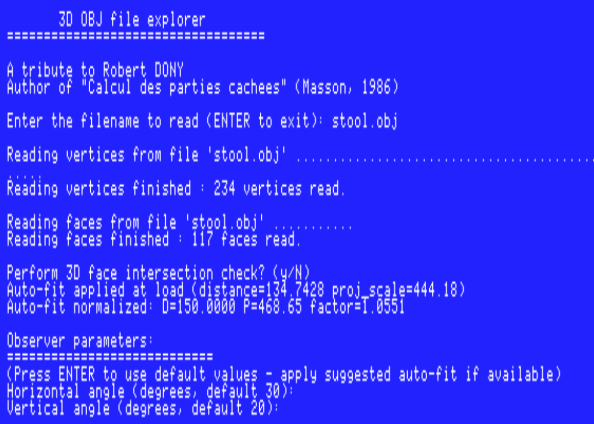
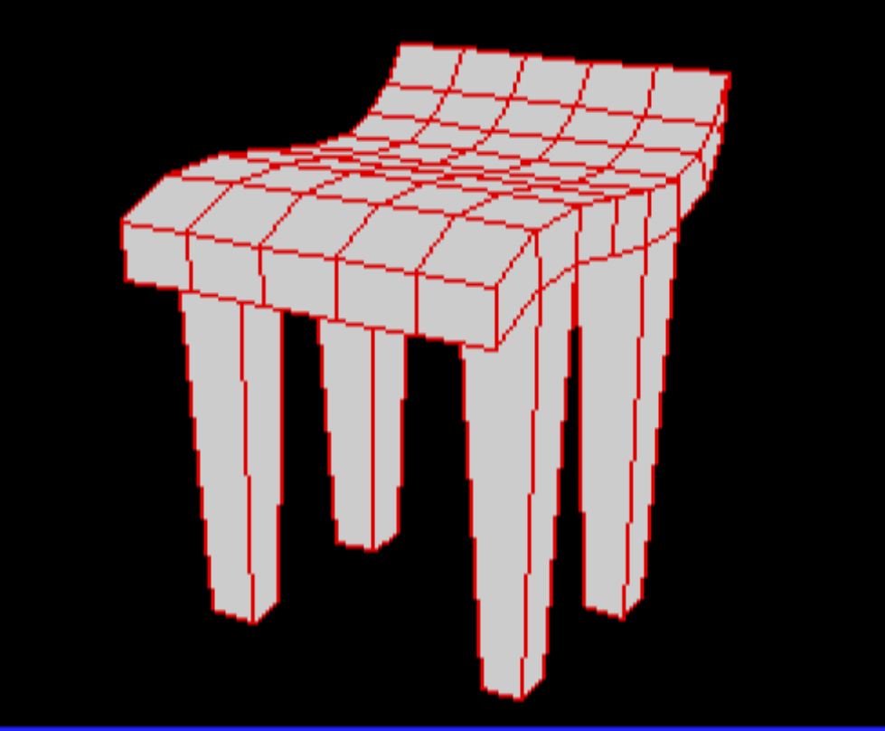

### Keyboard Controls Reference

#### Camera Movement
| Key | Action | Description |
|-----|--------|-------------|
| `A` / `Z` | Distance | Move camera closer (A) or farther (Z) |
| `Left` / `Right` | Horizontal Rotation | Rotate camera around vertical axis |
| `Up` / `Down` | Vertical Rotation | Rotate camera around horizontal axis |
| `W` / `X` | Screen Rotation | Rotate view around screen Z-axis |
| `+` / `-` | Projection Scale | Increase/decrease perspective scaling (±10%) |
| `K` | Edit Parameters | Manually enter camera distance and angles |

#### View Controls
| Key | Action | Description |
|-----|--------|-------------|
| `E` / `R` | Pan Left/Right | 2D screen offset (10 pixels) |
| `T` / `Y` | Pan Up/Down | 2D screen offset (10 pixels) |
| `0` | Reset Pan | Return to center position (0, 0) |
| `C` | Toggle Colors | Show/hide color palette |
| `J` | Toggle Jitter | Toggle stylized rendering that applies a random per-vertex 2D offset (0..10 px) |
| `P` | Wireframe Mode | Toggle between filled and frame-only polygons |
| `B` | Back-Face Culling | Enable/disable observer-space culling |
| `G` | Cycle Palette | Cycle through the 16 available SHR color palettes |
| `!` | Orientation Shading | Toggle orientation-based flat shading on/off |


#### Rendering Modes
| Key | Mode          | Algorithm/Description |
|-----|---------------|----------------------|
| `1` | FAST          | Simple Z-mean sorting (fastest) |
| `2` | BUBBLE SORT   | Full pairwise-comparison sort using a bubble-sort ordering pass |
| `3` | NEWELL SANCHA | Full Newell-Sancha with Fixed32/64 |
| `4` | GEO           | Geometry-only mode with plane-based ordering heuristics |
| `5` | GEO V3        | Geometry-only mode inspired by R. Dony's book, without face splitting |
| `6` | CORRECT       | Advanced ordering correction (homebrew implementation) |
| `7` | CORRECT V2    | Experimental local correction, homebrew implementation V2 (`painter_correctV2`) |
| `O` | Z-BUFFER      | Experimental scanline Z-buffer renderer (prototype, slow) |

#### Color Management
| Key | Action | Description |
|-----|--------|-------------|
| `8` | Random Colors (quick) | Set both fill and frame colors to random mode immediately (new colors on each press) |
| `>` | Choose Fill Color | Opens the interactive color chooser to select the interior color (0-15) or random mode |
| `<` | Choose Frame Color | Opens the interactive color chooser to select the outline color (0-15), random mode, or "same as fill" (no separate border) |
| `9` | Reset Colors | Restore default colors (fill=light gray/14, frame=red/7), reset palette to 0, and disable orientation shading |

**Interactive Color Chooser (`>` / `<` keys):**

Pressing `>` or `<` opens an on-screen color picker over a black background:
- Displays the 16 colors of the current SHR palette as numbered squares (0-15), plus a "Random" square and, for the frame chooser only, a "Same as fill" square.
- `Up` / `Down` arrows cycle through the 16 available color palettes; the picker updates instantly to show the new palette's colors.
- `Left` / `Right` arrows move the selection between color squares (highlighted with a white border).
- Any other key confirms the current selection and closes the picker.


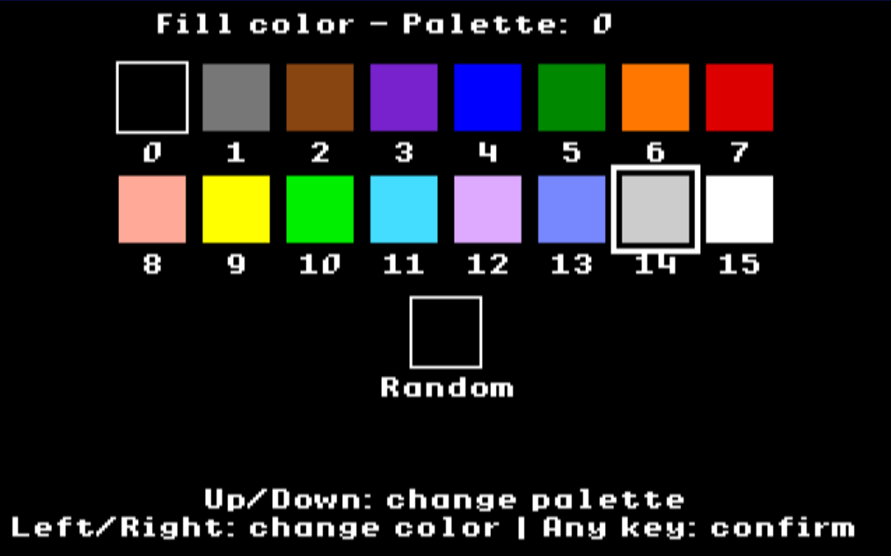
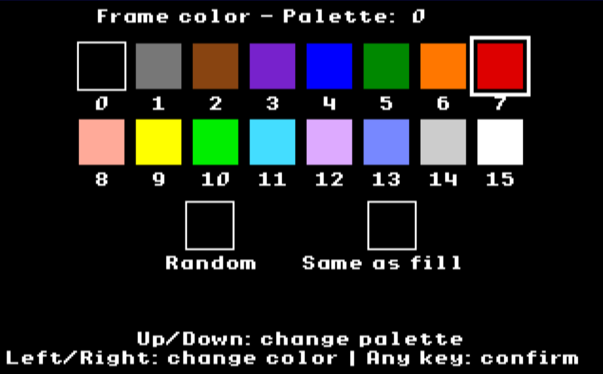
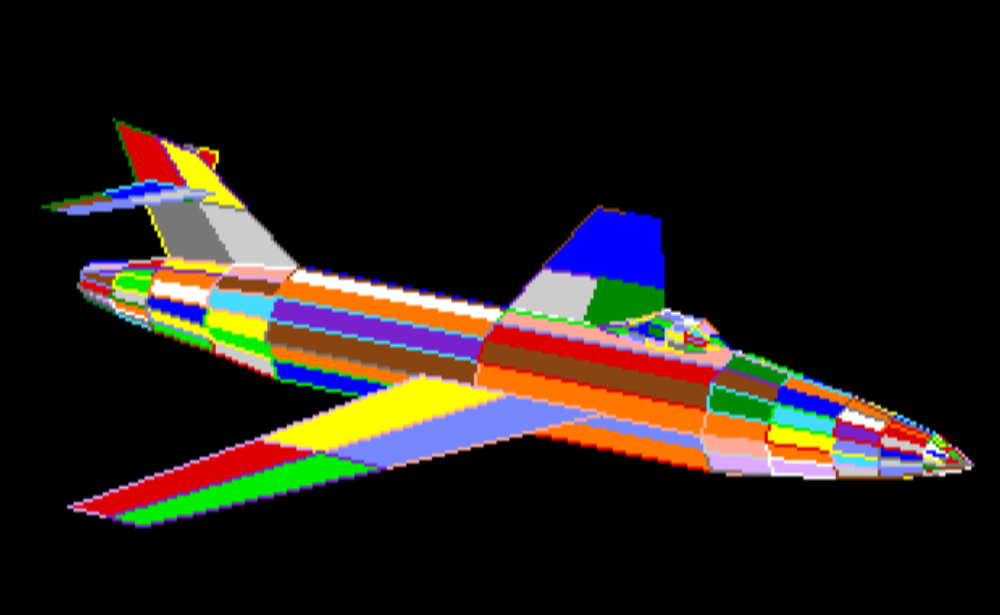

#### Diagnostic Tools
| Key | Action | Description |
|-----|--------|-------------|
| `V` | Show Face | Display single face (arrows to navigate); `N` toggles normal display; `Space` shows detailed textual info (ID, sorted position, orientation, hidden status, vertices, transformed 3D and 2D coords, plane equation), from which `F` saves to `Face<ID>.txt`, `V` reverses vertex order, `H`/`R`/`A` hide/restore/restore-all faces; any other key exits |
| `D` | Inspect Before | Analyze faces before selected face in sorted order (can apply moves with `A`/`O` during preview) |
| `S` | Inspect After | Analyze faces after selected face in sorted order (can apply moves with `A`/`O` during preview) |
| `M` | Debug Pair Plane | Interactive `pair_plane_before` diagnostics for two faces, prompts separately for `f1` and `f2` |
| `Q` | Inspect Face Pair | Interactive face-pair inspector for ordering anomalies |
| `;` | Repair Face Order | Run `check_sort_repair` to correct inverted or misordered faces |
| `I` | Toggle Inconclusive | Show/hide inconclusive face pairs with frames |
| `L` | Face ID Labels | Display face numbers centered on each polygon |
| `F` | Export Debug Data | Dump `Faces3D.csv`, `Faces2D.txt`, and `FacesOrder.txt` |

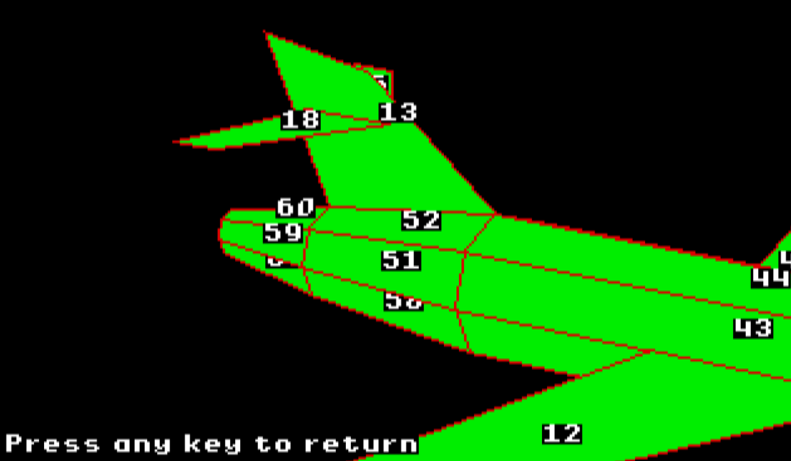


### Face Pair Inspector (`Q` key)

The `Q` key launches a dedicated interactive face-pair inspector for exploring face ordering diagnostics.

- Prompts separately for `f1` and `f2` face IDs.
- Displays the model in wireframe with `f1` highlighted in green and `f2` highlighted in orange.
- Runs the full diagnostic battery for the selected pair, including QuickDraw-based region tests, bounding-box checks, plane-side tests, and overlap analysis.
- Use the arrow keys to move between face pairs while in the inspector.
- Press `Space` to print the current computed test results and ordering decisions.
- Press `ESC` to exit the inspector and return to the main view.

### Face Order Repair (`;` key)

The `;` key runs `check_sort_repair`, which detects inverted or misordered faces and applies minimal fixes to restore a ray-cast consistent painter order.

- Performs a model-wide scan of face pairs that fail ordering checks.
- Uses precise ray cast verification (`ray_cast_distances` / `ray_cast_hierarchical`), `projected_polygons_overlap`, and centroid-based intersection tests to determine which face should come first.
- Repairs only the minimal offending ordering relations, preserving as much of the existing sort order as possible.
- Works with or without visualization:
  - In graphical mode it can display the current sorting state and highlighted pairs.
  - In automatic/no-graphics mode, it can proceed through the repair steps without rendering.
- Useful for correcting inverted faces and reducing ordering artifacts after loading complex models.
- Illustrated by `Screenshots/inspection_mode.png`, which shows the repair/inspection workflow in action.

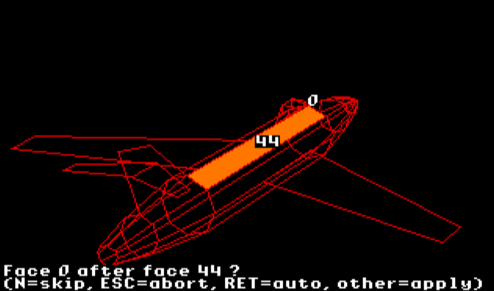
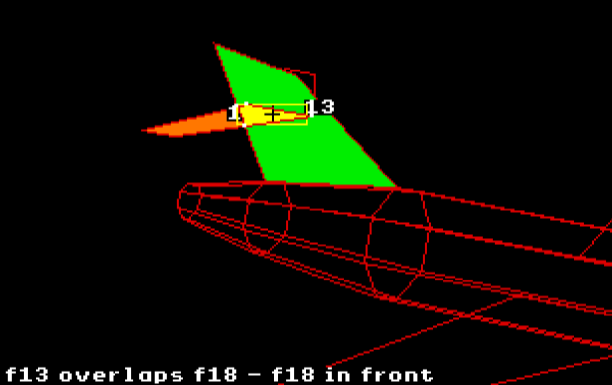
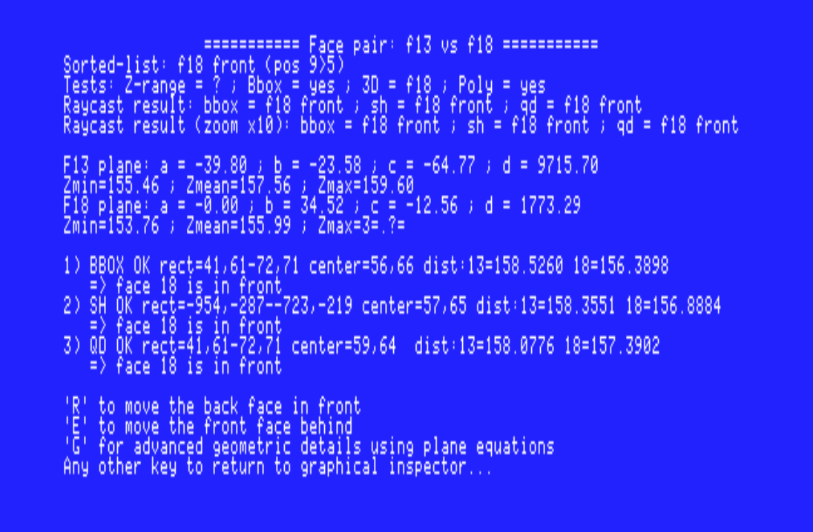
#### Navigation
| Key | Action | Description |
|-----|--------|-------------|
| `Space` | Model Info | Display vertices, faces, camera params, performance |
| `N` | New Model | Load different OBJ file (resets to FAST mode) |
| `H` | Help | Show paginated keyboard reference |
| `*` | Save Screenshot | Save the current SHR screen to disk as a native Apple IIGS Super Hi-Res picture (see "Screenshot Export" below) |
| `ESC` | Quit | Exit application |

### Screenshot Export (`*` key)

Saves the current SHR display to disk as an uncompressed native picture file, readable by GS/OS paint/viewer software (verified with CiderPress II):

- **Filename**: auto-incrementing `screenNNN.PIC` (e.g. `screen000.PIC`, `screen001.PIC`, ...) — the program scans the current directory and picks the first unused index, so nothing is ever overwritten.
- **Format**: raw (uncompressed) Super Hi-Res picture — 32000 bytes of pixel data, 256 bytes of Scan Control Bytes (200 real entries + 56 reserved padding bytes), and 512 bytes of color table data (16 palettes × 16 colors), matching the documented Apple IIGS SHR memory layout exactly.
- **ProDOS file type**: `$C1`, auxtype `$0000` ("Apple IIGS Super Hi-Res Graphic Screen Image" — the plain format matching this project's 16-shared-palettes-plus-per-scanline-SCB architecture, not the different $0002 "3200 colors" per-scanline-palette format).
- Screen memory and SCB bytes are copied via absolute-long-addressed 65816 assembly rather than a raw C pointer, to avoid a near/far pointer truncation issue that otherwise corrupts the saved image.
- Works after any renderer — the painter modes or the scanline Z-buffer — since it simply captures whatever is currently in SHR video memory.

### Workflow Example

**Typical Debugging Session:**

1. **Load Model** with `N` key
2. **Position Camera** using arrow keys and `A`/`Z`
3. **Customize Colors** (optional):
   - Press `8` for random colors (quick)
   - Press `>` to choose a specific fill color
   - Press `<` to choose a specific frame color
   - Press `9` to reset to defaults
4. **Select Rendering Mode** (`1`-`7`) based on geometry complexity
5. **Enable Inspection** with `I` to see inconclusive pairs
6. **Investigate Artifacts**:
   - Press `V` to view individual faces
   - Use `D` to inspect faces before problematic face (in preview press `A` to move all or `O` to move overlaps)
   - Use `S` to inspect faces after (in preview press `A` to move all or `O` to move overlaps)
7. **Adjust View** with `E`/`R`/`T`/`Y` for precise framing
8. **Export Data** with `F` for external analysis

### Face Inspection Mode

When using `D` (Inspect Before) or `S` (Inspect After):

1. **Enter Face ID**: Type the face number to inspect
2. **Orange/Pink Faces**: System highlights potentially misplaced faces
3. **Interactive Moves**:
   - Press `A`: Move **all** highlighted faces to correct position
   - Press `O`: Move only faces with **projected overlaps**
   - Press `ESC`: Cancel without changes

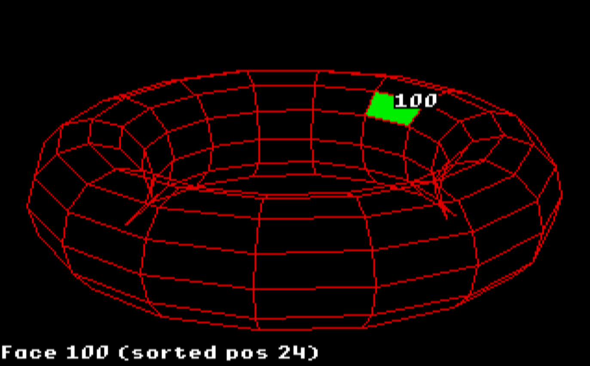

This interactive tool helps diagnose and correct painter algorithm ordering issues by visualizing depth conflicts.

### Single Face Viewer (`V` key)

- **Left/Right Arrows**: Navigate by face ID (decrement/increment)
- **Up/Down Arrows**: Navigate through sorted face array
- **N**: Toggle display of the selected face's normal (drawn as a fixed-length screen-space segment from the face centroid; works even when the face is hidden, using its saved vertex count)
- **Space**: Show detailed textual info about the current face:
  - ID and position in the sorted list
  - Orientation (`FRONT`/`BACK`) and hidden status (`HIDDEN`/`NOT HIDDEN`)
  - Vertex count and per-vertex data: index, model-space coordinates (x,y,z), observer-space coordinates (xo,yo,zo), and projected 2D coordinates (x2d,y2d) — shown even when the face is hidden, using its saved vertex count
  - Plane equation coefficients `(a, b, c, d)`
  - From this screen: `F` saves the details to `Face<ID>.txt`, `V` reverses the face's vertex order, `H` hides the face, `R` restores it, `A` restores every hidden face in the model, any other key returns to the graphical overlay
- **Any Other Key**: Exit viewer and return to full model

**Hide/Restore:** hiding a face (`H`) sets its vertex count to zero without discarding its geometry (the original count is saved internally), so the face stops being rendered and excluded from the painter's sort, while remaining selectable and shown in gray in the viewer. `R` restores the currently selected face and recomputes its plane/visibility (the model may have rotated while hidden). `A` restores every hidden face in the model in one pass.

Useful for examining individual face geometry and understanding the sorting order.

---

### Summary: Keys → C Functions Called 🔧

Below is a summary table of the most useful keys and the **C functions** they invoke (directly or via flags/modes). This helps map interactive behavior to code entry points when debugging:

| Key | Action (short) | C functions involved (entry point) |
|-----|-----------------|-----------------------------------------|
| `1`..`7` | Change painter mode | sets `painter_mode` → subsequently calls `painter_newell_sancha_fastV2` (FAST), a bubble-sort based ordering pass (BUBBLE SORT — exact function name not yet confirmed), `painter_newell_sancha` (NEWELL SANCHA), `painter_geo`/`painter_geoV2` (GEO), `painter_geoV3` (GEO V3), `painter_correct` (CORRECT), or `painter_correctV2` (CORRECT V2) depending on the mode |
| `O` | Scanline Z-buffer render (experimental) | `renderModelScanlineZBuffer` |
| `>` | Choose fill color | `colorChooser(0, &palette, ...)` — sets `user_fill_color`; also triggers `generate_random_colors` if random is chosen |
| `<` | Choose frame color | `colorChooser(1, &palette, ...)` — sets `user_frame_color`; also triggers `generate_random_colors` if random is chosen |
| `8` | Random colors (quick, both fill and frame) | sets `user_fill_color`/`user_frame_color` to random mode + `generate_random_colors` |
| `9` | Reset colors, palette, shading | resets `user_fill_color`/`user_frame_color`, `palette`, `shaded_by_orientation` |
| `G` | Cycle color palette | increments `palette` (mod 16) + `applyPalette` |
| `!` | Toggle orientation shading | `shaded_by_orientation` toggle + `computeOrientationShading` |
| `V` | Inspect a face | `showFace` — submenu `Space`: `V` (reverse vertex order), `H`/`R`/`A` (hide/restore/restoreAll), `F` (export) |
| `*` | Save screen | `saveNextScreenshot` → `saveSHRAsRawPic` ($C1/$0000 format, auto-incremented name `screenNNN.PIC`) |
| `A` / `Z` | Adjust camera distance | modifies `params.distance` and reloads the render |
| `E` / `R` / `T` / `Y` | 2D panning | modifies `pan_dx` / `pan_dy` and redraws |
| `B` | Toggle back-face culling | `cull_back_faces` + reprocess model |
| `P` | Wireframe mode | `framePolyOnly` + redraw / reprocess |
| `C` | Color palette overlay | `colorpalette` toggle |
| `J` | Render jitter | `jitter` toggle |
| `K` | Edit angles/distance | `getObserverParams` |
| `D` / `S` | Inspect faces before / after | `inspect_faces_before` / `inspect_faces_after` |
| `M` | Debug `pair_plane_before` | `pair_plane_geometric_tests` |
| `F` | Debug CSV export | `dumpFaceEquationsCSV` + `dumpFace2DCoordinates` + `dumpSortedFaceIndices` |
| `N` | Load new model | `destroyModel3D` + `loadModel3D` |
| `H` | Paged help | `show_help_pager` |
| `ESC` | Exit | cleanup + exit |

> Note: Some commands invoke multiple utilities (e.g., `F` writes `Faces3D.csv`, `Faces2D.txt`, and `FacesOrder.txt`). To investigate specific behavior, start by using the corresponding key in the interface, then consult the output files (`Faces3D.csv`, `Faces2D.txt`, `FacesOrder.txt`, `Face<ID>.txt`) to reproduce/automate tests.

---

## File Format

3D Explorer reads simplified Wavefront OBJ files:

```obj
# Vertex definitions (x y z)
v 0.0 0.0 0.0
v 1.0 0.0 0.0
v 1.0 1.0 0.0
v 0.0 1.0 0.0

# Face definitions (vertex indices, 1-based)
f 1 2 3 4
f 5 6 7 8
```

**Requirements:**
- Only `v` (vertex) and `f` (face) lines are parsed
- Vertex indices in faces are 1-based (OBJ standard)
- Faces can be triangles, quads, or polygons with more vertices
- Comments (`#`) are ignored

**Unsupported OBJ features:**
- Texture coordinates (`vt`)
- Normals (`vn`)
- Materials (`mtllib`, `usemtl`)
- Groups (`g`)


## Building from Source

**Requirements:**
- Apple IIGS with ORCA/C 2.2.1 or later
- Golden Gate development environment

**Compilation:**
```bash
iix compile 3DExplorer.cc
iix -DKeepType=S16 link 3DExplorer keep=3DExplorer
```

**Deployment:**
This Python script does everything : compile, link and deployment of the application to images disks and Android phone (for KEGS Android app).
```bash
python DEPLOY.py
```

## Implementation Notes

### Memory Management

- **Dynamic Allocation**: Vertex and face arrays resize automatically via `ensure_vertex_capacity()` and `ensure_face_capacity()`
- **Handle-Based Graphics**: QuickDraw polygons use persistent locked handles to minimize allocation overhead
- **Memory Model**: Uses `#pragma memorymodel 1` for efficient 16-bit addressing

### Code Organization

- **Segment Directives**: Code divided into segments (`code22`, `data`) for memory bank management
- **Inline Assembly**: Critical keyboard input uses 65816 assembly for direct hardware access
- **Compile-Time Optimization**: Debug code conditionally compiled via `#if ENABLE_DEBUG_SAVE`

### Coordinate Systems

1. **Model Space**: Original OBJ coordinates
2. **Observer Space**: After camera transformation (xo, yo, zo)
3. **Screen Space**: 2D projected coordinates (x2d, y2d) + pan offsets

**Screen Origin**: (160, 100) represents center of 320×200 display

## Known Limitations and requirements 

- **Polygon Splitting**: Basic in‑memory splitting on load (faces cut by intersecting planes) now implemented to eliminate simple interpenetrations
- **Transparency**: Not supported; all polygons are opaque
- **Lighting**: Minimal shading model (use ! key to activate shading, in conjonction with palette # > 0)
- **Large Models**: Performance degrades significantly above ~500 faces in GEO and NEWELL SANCHA modes. 
- **Memory Constraints**: Maximum model size limited by available Apple IIGS RAM. This program requires 1 Mb.

## Future Enhancements

- Improve and extend polygon splitting logic (currently handles simple plane cuts on load)
- Optimize CORRECT mode for better performance
- Support textured polygons
- Implement better lighting model
- Optimize screenshot export (`*` key): current implementation copies SHR memory one byte at a time via inline assembly, which is correct but slow — a line-at-a-time (or full-buffer) assembly copy would be significantly faster
- Optimize the scanline Z-buffer renderer (`O` key) for interactive framerates, and/or extend it with a font/adaptive resolution to speed up per-pixel depth interpolation

## Credits

**Author**: Bruno  
**Platform**: Apple IIGS  
**Development Tools**: ORCA/C 2.2.1, Golden Gate, iix

**Algorithm References**:
- "Calcul des parties cachées", Robert DONY, Masson, 1986*
- Newell, M.E., Newell, R.G., and Sancha, T.L. (1972). "A solution to the hidden surface problem"
- Painter's algorithm theory and implementation techniques

## License

This project is licensed under the **Creative Commons Attribution 4.0 International License (CC BY 4.0)**.

You are free to:
- **Share**: Copy and redistribute the material in any medium or format
- **Adapt**: Remix, transform, and build upon the material for any purpose, even commercially

Under the following terms:
- **Attribution**: You must give appropriate credit to the original author and a link to this repository.

### Disclaimer

This software is provided "as is", without warranty of any kind, express or implied. The author assumes no responsibility for any damages or issues arising from the use of this software. Use at your own risk.

---

For questions, bug reports, or contributions, please visit the project repository.
