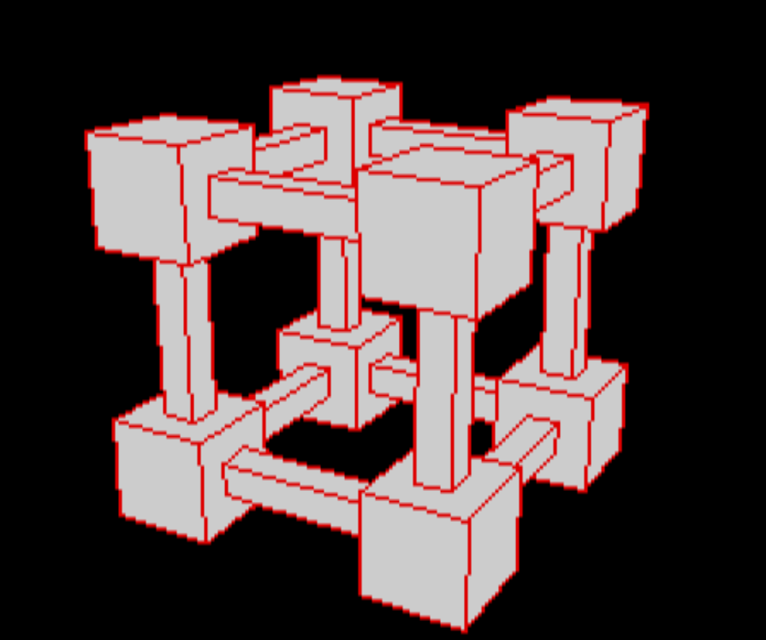
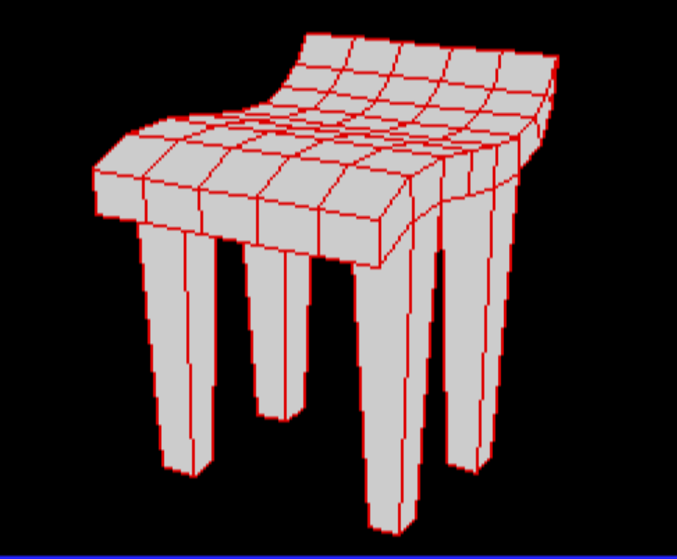
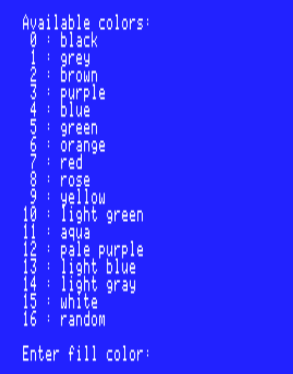
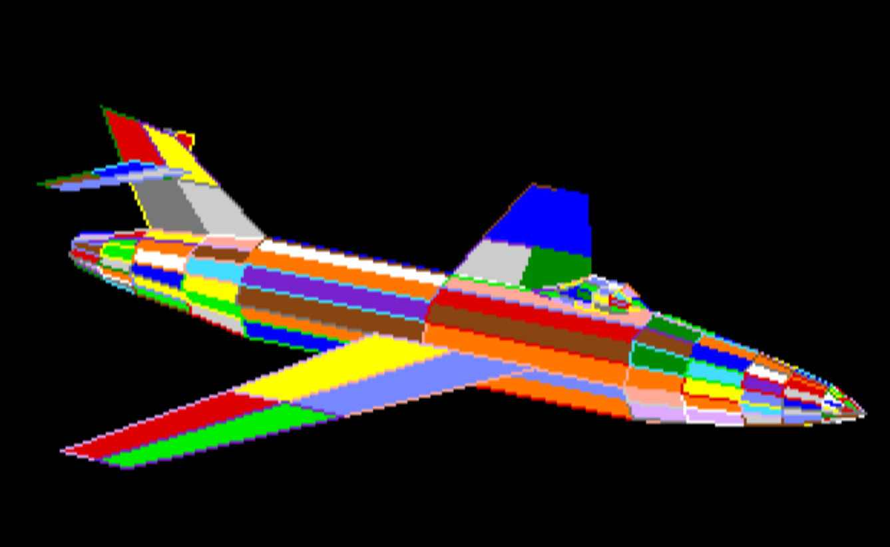
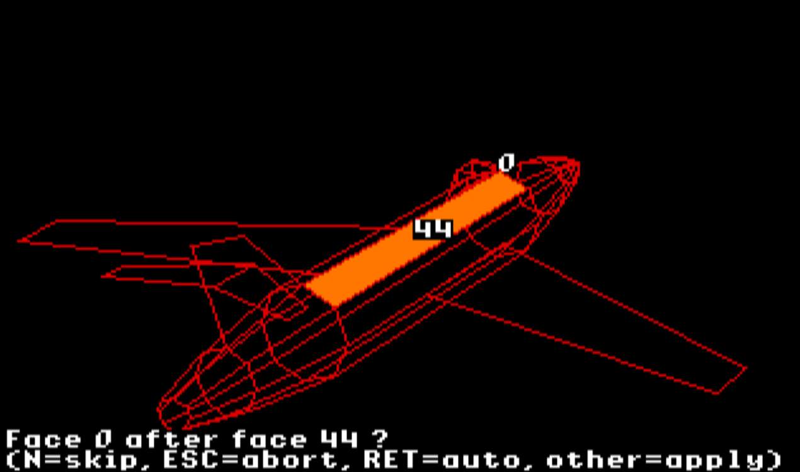
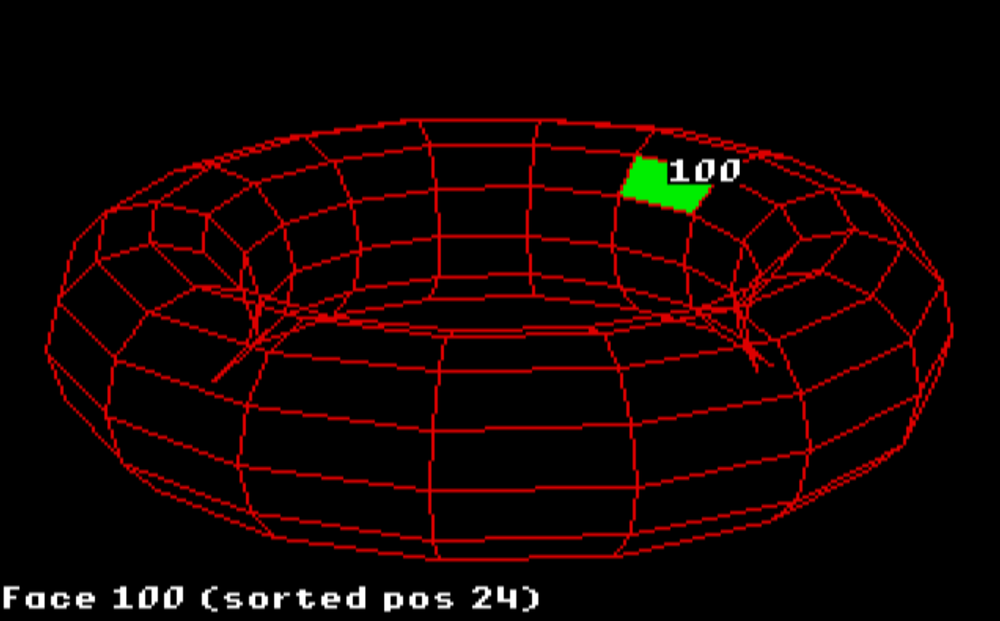

# 3D Explorer for Apple IIGS

**A Tribute to Robert DONY**  
*Author of "Calcul des parties cachées", Masson, 1986*

A high-performance 3D model viewer implementing multiple painter's algorithms, specifically designed for the Apple IIGS computer using ORCA/C and the QuickDraw graphics API.



## Overview

3D Explorer is an interactive 3D rendering application that reads simplified Wavefront OBJ files and displays them with real-time manipulation capabilities. The project demonstrates advanced rendering techniques on resource-constrained hardware (Apple IIGS with 2.8 MHz 65C816 CPU) through careful optimization and multiple algorithm implementations.

### Key Features

- **Multiple Painter Algorithms**: Four distinct rendering modes optimized for different use cases
  - **FAST**: Simple Z-mean sorting with bounding box tests (highest performance)
  - **NORMAL**: Full Newell-Sancha algorithm with Fixed32/64 arithmetic (robust)
  - **FLOAT**: Float-based painter for higher precision
  - **CORRECT**: Advanced ordering correction with local face reordering
  
- **3D Manipulation**: Interactive camera controls with adjustable distance, rotation angles, and 2D panning
- **Advanced Culling**: Observer-space back-face culling to eliminate hidden polygons
- **Diagnostic Tools**: Face inspection, overlap detection, and visual debugging capabilities
- **Fixed-Point Arithmetic**: Optimized 16.16 fixed-point math for efficient 3D transformations
- **Performance Optimization**: Precomputed trigonometric tables and memory buffer reuse

## Technical Architecture

### Graphics Pipeline

1. **Model Loading**: Parse simplified OBJ files (vertices `v` and faces `f`)
2. **3D Transformation**: Transform model vertices from world space to observer space
3. **Projection**: Convert 3D coordinates to 2D screen space with perspective correction
4. **Face Sorting**: Apply selected painter algorithm to determine rendering order
5. **Rasterization**: Draw filled polygons using QuickDraw API

### Rendering Modes

#### FAST Mode (Key: `1`)
- Simple face sorting by Z-mean (average depth)
- Bounding box overlap tests for early rejection
- Best for high frame rates on simple geometry
- Limitations: May produce artifacts on complex overlapping polygons

#### NORMAL Mode (Key: `2`) — NEWELL_SANCHAV1
- Full Newell-Sancha (V1) pairwise comparison algorithm (implemented as `painter_newell_sancha`)
- Comprehensive geometric tests per face pair:
  1. **Test 1**: Z-extents overlap check (cheap rejection)
  2. **Test 2**: X-extents overlap check
  3. **Test 3**: Y-extents overlap check
  4. **Test 3bis**: Projected polygon overlap check (early conclusion if no overlap)
  5. **Test 4**: All vertices of f2 on observer's side of f1's plane
  6. **Test 5**: All vertices of f1 on opposite side of f2's plane
  7. **Test 6**: All vertices of f2 on opposite side of f1's plane (requires swap)
  8. **Test 7**: All vertices of f1 on observer's side of f2's plane (requires swap)
- Projected polygon overlap test as final verification when all other tests are inconclusive
- Fixed32 (16.16) and Fixed64 (32.32) arithmetic throughout
- Most robust for complex geometry

#### NEWELL_SANCHAV2 Mode (Key: `3`)
- Variant of the Newell-Sancha painter (V2)
- Fixed-point-based algorithm with improved local ordering behavior (`painter_newell_sanchaV2`)
- Recommended for certain pathological meshes where the V2 heuristic helps reduce inconclusive pairs

#### FLOAT Mode (Key: `U`)
- Floating-point implementation of the painter's algorithm
- Higher precision calculations
- Faster on platforms with FPU support

#### CORRECT Mode (Key: `4`)
- Extends NORMAL mode with local face reordering
- Attempts to resolve ordering conflicts through strategic swaps
- Best for geometries with many inconclusive pairs
- Much slower

#### CORRECT V2 Mode (Key: `5`)
- Experimental variant: `painter_correctV2`
- Improves robustness of face sorting when culling is OFF
- Locally corrects cases where a BACK face appears in front and overlaps a FRONT face
- Uses geometric plane tests and zmean as fallback for local corrections (no global reordering)
- Diagnostic/log code is present but disabled by default (file output commented out, can be re-enabled for analysis)
- Slower, mainly for pathological models or advanced debugging

### Mathematical Implementation

**Fixed-Point Arithmetic:**
```c
#define FIXED_SHIFT 16
#define FIXED_SCALE (1L << FIXED_SHIFT)  // 65536
typedef long Fixed32;    // 16.16 format
typedef int64_t Fixed64; // 32.32 format
```

**3D Transformations:**
- Rotation matrices computed with precomputed sine/cosine tables (720 entries, 0.5° precision)
- Observer-space transformation: `(xo, yo, zo) = R_h * R_v * (x - cx, y - cy, z - cz)`
- Perspective projection: `x2d = 160 + (xo * scale / zo)`, `y2d = 100 - (yo * scale / zo)`

**Plane Equations:**
For each face, compute plane coefficients (a, b, c, d) where:
- `ax + by + cz + d = 0`
- Normal vector computed via cross product of two edges
- Used for sidedness tests in painter algorithm

### Back-Face Culling

Observer-space culling eliminates faces oriented away from the viewer:
- Test: `d <= 0` (where d is the plane equation constant in observer space)
- Culled faces excluded from sorting to improve performance and correctness
- Toggle at runtime with `B` key

### Performance Optimizations

1. **Preprocessor Directives**: Debug code eliminated at compile time with `#if ENABLE_DEBUG_SAVE`
   - Saves 5KB binary size (~3% reduction)
   - 2% performance improvement in painter functions

2. **Precomputed Tables**: Sine/cosine tables avoid runtime trigonometric calculations

3. **Buffer Reuse**: Persistent polygon handles and memory buffers reduce allocations

4. **Selective Sorting**: When culling enabled, only visible faces participate in painter algorithm

## User Guide

### Getting Started

1. **Launch Application**: Run `3D Explorer` from your Apple IIGS
2. **Enter Filename**: Type the OBJ filename when prompted (or press ENTER to exit)
3. **Model Loads**: The application parses vertices and faces, applies auto-fit if available
4. **Set Camera Parameters**: Confirm or modify observer settings:
   - **Horizontal Angle**: Rotation around vertical axis in degrees (ENTER for default 30°)
   - **Vertical Angle**: Rotation around horizontal axis in degrees (ENTER for default 20°)
   - **Screen Rotation**: Rotation around screen Z-axis in degrees (ENTER for default 0°)
   - **Distance**: Camera distance from model origin (ENTER accepts default/auto-fit value)
5. **View Model**: The 3D model renders with your camera configuration




### Keyboard Controls Reference

#### Camera Movement
| Key | Action | Description |
|-----|--------|-------------|
| `A` / `Z` | Distance | Move camera closer (A) or farther (Z) |
| `Left` / `Right` | Horizontal Rotation | Rotate camera around vertical axis |
| `Up` / `Down` | Vertical Rotation | Rotate camera around horizontal axis |
| `W` / `X` | Screen Rotation | Rotate view around screen Z-axis |
| `+` / `-` | Projection Scale | Increase/decrease perspective scaling (±10%) |
| `K` | Edit Parameters | Manually enter camera distance and angles |

#### View Controls
| Key | Action | Description |
|-----|--------|-------------|
| `E` / `R` | Pan Left/Right | 2D screen offset (10 pixels) |
| `T` / `Y` | Pan Up/Down | 2D screen offset (10 pixels) |
| `0` | Reset Pan | Return to center position (0, 0) |
| `C` | Toggle Colors | Show/hide color palette |
| `J` | Toggle Jitter | Toggle stylized rendering that applies a random per-vertex 2D offset (0..10 px) |
| `P` | Wireframe Mode | Toggle between filled and frame-only polygons |
| `B` | Back-Face Culling | Enable/disable observer-space culling |


#### Rendering Modes
| Key | Mode        | Algorithm/Description |
|-----|-------------|----------------------|
| `1` | FAST        | Simple Z-mean sorting (fastest) |
| `2` | NORMAL      | Full Newell-Sancha with Fixed32/64 |
| `3` | FLOAT       | Floating-point painter |
| `4` | CORRECT     | Advanced ordering correction |
| `5` | CORRECT V2  | Experimental local correction (painter_correctV2) |

#### Color Management
| Key | Action | Description |
|-----|--------|-------------|
| `6` | Random Colors | Set both fill and frame colors to random mode (new colors on each press) |
| `7` | Choose Fill Color | Select interior color (0-15) or random mode (16) |
| `8` | Choose Frame Color | Select outline color (0-15) or random mode (16) |
| `9` | Reset Colors | Restore default colors (fill=white/14, frame=red/7) |

**Color Palette (0-15):**
- 0: black, 1: grey, 2: brown, 3: purple, 4: blue, 5: green
- 6: orange, 7: red, 8: rose, 9: yellow, 10: light green, 11: aqua
- 12: pale purple, 13: light blue, 14: light gray, 15: white
- 16: random (generates unique colors per face)




#### Diagnostic Tools
| Key | Action | Description |
|-----|--------|-------------|
| `V` | Show Face | Display single face (arrows to navigate); `Space` shows detailed textual info (ID, sorted position, vertices, transformed 3D and 2D coords, plane equation); `F` saves details to `Face<ID>.txt`; any other key exits |
| `D` | Inspect Before | Analyze faces before selected face in sorted order (can apply moves with `A`/`O` during preview) |
| `S` | Inspect After | Analyze faces after selected face in sorted order (can apply moves with `A`/`O` during preview) |
| `O` | Overlap Check | Test projected polygon overlap between two faces |
| `A` | Scan All Overlaps | Scan all bbox-intersecting face pairs and save `overlapall.csv` and `overlap.csv` (temporarily disables `J` jitter for deterministic results) |
| `I` | Toggle Inconclusive | Show/hide inconclusive face pairs with frames |
| `L` | Face ID Labels | Display face numbers centered on each polygon |
| `F` | Export Debug Data | Dump face equations to `equ.csv` |

#### Navigation
| Key | Action | Description |
|-----|--------|-------------|
| `Space` | Model Info | Display vertices, faces, camera params, performance |
| `N` | New Model | Load different OBJ file (resets to FAST mode) |
| `H` | Help | Show paginated keyboard reference |
| `ESC` | Quit | Exit application |

### Workflow Example



**Typical Debugging Session:**

1. **Load Model** with `N` key
2. **Position Camera** using arrow keys and `A`/`Z`
3. **Customize Colors** (optional):
   - Press `6` for random colors
   - Press `7` to choose a specific fill color
   - Press `8` to choose a specific frame color
   - Press `9` to reset to defaults
4. **Select Rendering Mode** (`1`-`5`) based on geometry complexity
5. **Enable Inspection** with `I` to see inconclusive pairs
6. **Investigate Artifacts**:
   - Press `V` to view individual faces
   - Use `D` to inspect faces before problematic face (in preview press `A` to move all or `O` to move overlaps)
   - Use `S` to inspect faces after (in preview press `A` to move all or `O` to move overlaps)
   - Press `O` to check specific overlap conditions
7. **Adjust View** with `E`/`R`/`T`/`Y` for precise framing
8. **Export Data** with `F` for external analysis

### Face Inspection Mode

When using `D` (Inspect Before) or `S` (Inspect After):

1. **Enter Face ID**: Type the face number to inspect
2. **Orange/Pink Faces**: System highlights potentially misplaced faces
3. **Interactive Moves**:
   - Press `A`: Move **all** highlighted faces to correct position
   - Press `O`: Move only faces with **projected overlaps**
   - Press `ESC`: Cancel without changes



This interactive tool helps diagnose and correct painter algorithm ordering issues by visualizing depth conflicts.

### Single Face Viewer (`V` key)

- **Left/Right Arrows**: Navigate by face ID (decrement/increment)
- **Up/Down Arrows**: Navigate through sorted face array
- **Space**: Show detailed textual info about the current face:
  - ID and position in the sorted list
  - Vertex count and per-vertex data: index, model-space coordinates (x,y,z), observer-space coordinates (xo,yo,zo), and projected 2D coordinates (x2d,y2d)
  - Plane equation coefficients `(a, b, c, d)`
  - Press any key to return to the graphical overlay
- **F**: When viewing textual info, press `F` (or `f`) to save the details to a file named `Face<ID>.txt` (example: `Face42.txt`). A confirmation message is shown and pressing any key returns to the overlay.
- **Any Other Key**: Exit viewer and return to full model

Useful for examining individual face geometry and understanding the sorting order.

---

### Récapitulatif : touches → fonctions C appelées 🔧

Ci‑dessous un tableau récapitulatif des touches les plus utiles et des **fonctions C** qu'elles invoquent (directement ou via flags / modes). Cela aide à relier le comportement interactif aux points d'entrée du code lorsque vous faites du debug :

| Touche | Action (concis) | Fonctions C impliquées (point d'entrée) |
|--------|-----------------|-----------------------------------------|
| `1`..`5` | Changer le mode de painter | modifie `painter_mode` → appelle ensuite `painter_newell_sancha_fast`, `painter_newell_sancha`, `painter_newell_sancha_float`, `painter_newell_sanchaV2`, `painter_correctV2` selon le mode |
| `O` / `o` | Vérifier le recouvrement projeté entre deux faces | `inspect_polygons_overlap` → `projected_polygons_overlap` (strict) |
| `A` | Scanner toutes les paires qui se recoupent en bbox (écrit CSV) | `/* A key handler */` → `projected_polygons_overlap` + `compute_intersection_centroid` (debug CSV) |
| `>` | Inspecteur `ray_cast` interactif | `inspect_ray_cast` → `compute_intersection_centroid` (centroid) → `ray_cast_at` (utilise `faces->plane_*`) |
| `V` | Afficher une face (overlay, détails) | `showFace` → `drawFace` (rend la face), sauvegarde via `Face<ID>.txt` |
| `D` / `S` | Inspecter faces avant / après (diagnostic & moves) | `inspect_faces_before` / `inspect_faces_after` → utilise `projected_polygons_overlap`, `move_element_remove_and_insert_pos`, et tests plane (`pair_plane_after` / `pair_plane_before`) |
| `I` | Basculer affichage des paires inconclusives | `frameInconclusivePairs` (affichage) |
| `F` | Export CSV debug | `dumpFaceEquationsCSV` (export des plans/z_min/z_mean/bboxes) |
| `J` | Toggle jitter (render) | affecte `drawPolygons_jitter` vs `drawPolygons` (impacte la reproductibilité des scans) |
| Arrow keys | Navigation / caméra | modifie `ObserverParams` via `getObserverParams` (K key) et rafraîchit le rendu |
| `N` | Charger nouveau modèle | `destroyModel3D` + `loadModel3D` (réinitialise `painter_mode`, `jitter`, etc.) |

> Note : certaines commandes appellent plusieurs utilitaires (par ex. `A` construit `overlapall.csv` puis exécute des échantillonnages et des découpages via `compute_intersection_centroid` pour le debug). Pour investiguer un comportement précis, commencez par utiliser la touche correspondante dans l'interface, puis consultez les fichiers CSV de sortie (`overlap.csv`, `overlapall.csv`, `equ.csv`, `Face<ID>.txt`) pour reproduire/automatiser les tests.

---

Si tu veux, j'ajoute des liens (anchors) dans le README qui pointent vers les définitions de ces fonctions dans le code (façon 

## File Format

3D Explorer reads simplified Wavefront OBJ files:

```obj
# Vertex definitions (x y z)
v 0.0 0.0 0.0
v 1.0 0.0 0.0
v 1.0 1.0 0.0
v 0.0 1.0 0.0

# Face definitions (vertex indices, 1-based)
f 1 2 3 4
f 5 6 7 8
```

**Requirements:**
- Only `v` (vertex) and `f` (face) lines are parsed
- Vertex indices in faces are 1-based (OBJ standard)
- Faces can be triangles, quads, or polygons with more vertices
- Comments (`#`) are ignored

**Unsupported OBJ features:**
- Texture coordinates (`vt`)
- Normals (`vn`)
- Materials (`mtllib`, `usemtl`)
- Groups (`g`)


## Building from Source

**Requirements:**
- Apple IIGS with ORCA/C 2.2.1 or later
- Golden Gate development environment

**Compilation:**
```bash
iix compile 3DExplorer.cc
iix link 3DExplorer
```

**Deployment:**
```bash
python DEPLOY.py
```

This copies the compiled binary to a bootable disk image for use with emulators or real hardware.

## Implementation Notes

### Memory Management

- **Dynamic Allocation**: Vertex and face arrays resize automatically via `ensure_vertex_capacity()` and `ensure_face_capacity()`
- **Handle-Based Graphics**: QuickDraw polygons use persistent locked handles to minimize allocation overhead
- **Memory Model**: Uses `#pragma memorymodel 1` for efficient 16-bit addressing

### Code Organization

- **Segment Directives**: Code divided into segments (`code22`, `data`) for memory bank management
- **Inline Assembly**: Critical keyboard input uses 65816 assembly for direct hardware access
- **Compile-Time Optimization**: Debug code conditionally compiled via `#if ENABLE_DEBUG_SAVE`

### Coordinate Systems

1. **Model Space**: Original OBJ coordinates
2. **Observer Space**: After camera transformation (xo, yo, zo)
3. **Screen Space**: 2D projected coordinates (x2d, y2d) + pan offsets

**Screen Origin**: (160, 100) represents center of 320×200 display

## Known Limitations

- **Polygon Splitting**: Not implemented; complex overlapping geometry may produce artifacts
- **Transparency**: Not supported; all polygons are opaque
- **Lighting**: No shading model; faces use flat colors from palette
- **Large Models**: Performance degrades significantly above ~500 faces in NORMAL mode
- **Memory Constraints**: Maximum model size limited by available Apple IIGS RAM

## Future Enhancements

- Implement polygon splitting for perfect accuracy
- Add Z-buffer rendering mode as alternative to painter's algorithm
- Optimize CORRECT mode for better performance
- Support textured polygons
- Implement simple lighting model (flat shading)

## Development History

- **2026-01-03**: Initial implementation with FAST mode
- **2026-01-10**: Added NORMAL mode with full Newell-Sancha algorithm
- **2026-01-12**: Implemented diagnostic tools (inspect, overlap check)
- **2026-01-14**: Added interactive face navigation and showFace viewer
- **2026-01-15**: Optimized debug code with preprocessor directives (-5KB, +2% speed)
- **2026-01-15**: Implemented custom color management system with random color generation

## Credits

**Author**: Bruno  
**Platform**: Apple IIGS  
**Development Tools**: ORCA/C 2.2.1, Golden Gate, iix

**Algorithm References**:
- Newell, M.E., Newell, R.G., and Sancha, T.L. (1972). "A solution to the hidden surface problem"
- Painter's algorithm theory and implementation techniques

## License

This project is licensed under the **Creative Commons Attribution 4.0 International License (CC BY 4.0)**.

You are free to:
- **Share**: Copy and redistribute the material in any medium or format
- **Adapt**: Remix, transform, and build upon the material for any purpose, even commercially

Under the following terms:
- **Attribution**: You must give appropriate credit to the original author

### Disclaimer

This software is provided "as is", without warranty of any kind, express or implied. The author assumes no responsibility for any damages or issues arising from the use of this software. Use at your own risk.

---

For questions, bug reports, or contributions, please visit the project repository.
